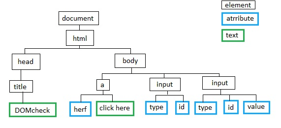

# 문서 스크립팅

클라이언트 측 자바스크립트는 정적인 HTML문서를 상호작용이 가능한 웹앱으로 바꾸는 역할을 한다. 
이렇게 웹페이지의 내용을 제어하는 것이 자바스크립트의 주된 작업이다. <br>
13,14장에서는 Window 객체를 나타내는 브라우저창, 탭, 프레임에 대한 내용이었다. <br>
문서 스크립팅은 이 책의 가장 중요한 장 중 하나로, 문서 내용 제어에 대한 설명이다. <br
모든 Window 객체에는 Document객체를 참조하는 document프로퍼티가 존재한다. Document객체는 해당 창의 내용을 나타낸다.
Document객체는 DOM(문서객체모델)이라는 API의 일부이며 문서의 내용을 나타내고 조작하는 역할을 하는 아주 중요한 객체다.

<br>

### DOM개요
DOM은 HTML과 XML문서의 내용을 조작하고 나타내는 기반 API이다. HTML,XML문서의 요소 집합은 DOM에서 객체의 계층구조로 표현된다.
이렇게 노드들로 계층구조를 이루고 있다. 
<br>

<br>
각 사각형은 문서의 노드이며 Node 객체를 말한다. 그림을 보면 노드의 종류가 세 가지임을 알 수 있다.
1. 문서전체를 나타대는 <code>Document노드</code>
2. HTML요소를 나타대는 <code>Element노드</code>
3. Text를 나타내는 <code>Text노드</code>

Document와 Element는 DOM에서 가장 중요한 클래스이다.


<br>
Node와 그 하위 타입을 계층 구조로 보여준다. 제네릭 타입인 Document, Element타입과 일반 타입인 HTMLDocument, HTMLElement차입 사이에는 명확한 차이가 있다. 
- Document타입은 HTML,XML 문서
- Element타입은 그 문서의 요소를 말함.


<br>

### 문서 요소 선택
대부분의 클라이언트 측 JS프로그램은 하나 이상의 문서 요소에 특정 작업을 한다. <br>
Document객체를 참조할 때는 전역변수 document를 사용하면 되지만 문서의 각 요소를 수정하려면 해당 요소를 가리키는 Element객체를 선택할 방법이 있어야한다. DOM에서 요소를 선택하는 다양한 방법이 있다.
- id 속성을 지정해서 선택
- name 속성을 지정해서 선택
- HTML 태그 이름을 지정해서 선택
- CSS class 이름을 지정해서 선택
- 지정한 CSS선택자와 일치 여부로 선택

#### 1. ID로 선택
id속성의 값은 한 문서 안에서 유일하다. 
```javascript
var section = document.getElementById("section1");
```
getElementById()함수로 id가 section1인 요소를 찾아 변수 section안에 할당한 것이다.

#### 2. Name으로 요소 선택
HTML name 속성의 원래 목적은 폼요소에 이름을 부여하는 것으로, 폼데이터를 서버로 전송할 때 사용한다. name속성은 id속성과 같은 방식으로 요소에 이름을 부여하지만 name속성의 값은 문서 안에서 id속성과 달리 유일성이 보장되지 않고 여러 요소의 이름이 같을 수 있다. <br>
폼 안의 라디오 버튼, 체크박스같은 요소에서 주로 나타단다.
```javascript
var radiobuttons = document.getElementByName("favorite_color");
```
getElementysByName()메소드는 Document클래스가 아닌 HTMLDocument클래스에 정의되어 있다. 그렇기 때문에 XML문서에서는 사용할 수 없다.
이 메서드는 Element객체의 읽기 전용 배열처럼 동작하는 NodeList객체를 반환한다. IE에서는 getElementsByName()도 getElementById()처럼 
name 속성뿐만 아니라 id속성의 값이 같아도 요소를 반환한다. 그러므로 오류방지를 위해서 name과 ID에 같은 문자열을 사용하면 안된다.

#### 3. Type으로 요소 선택하기
Document객체의 getElementsByTagName()메서드를 사용하면 같은 Type(또는 태그 이름)의 HTML이나 XML요소를 한 번에 모두 선택할 수 있다.
```javascript
var spans = document.getElementsByTagName("span");
```
getElementsByName()과 getElementsByTagName()과 같은 메서드는 NodeList객체를 반환한다.

#### 4. CSS Class로 요소 선택하기
HTML요소의 class속성 값은 여러개의 식별자가 공백으로 구분된 리스트다.

<br>

### 문서 구조와 탐색
Document객체와 그 속의 Element객체, 그리고 문서의 텍스트 변화를 나타내는 Text객체 모두는 Node객체이다.

#### 1. 문서가 노드트리일 때
- <code>parentNode</code>
- <code>childNodes</code>
- <code>firstChild</code>
- <code>lastChild</code>
- <code>nextSibling</code>
- <code>nodeType</code>
- <code>nodeValue</code>
- <code>nodeName</code>
- <code>firstChild</code>

#### 2. 문서가 Element트리일 때


